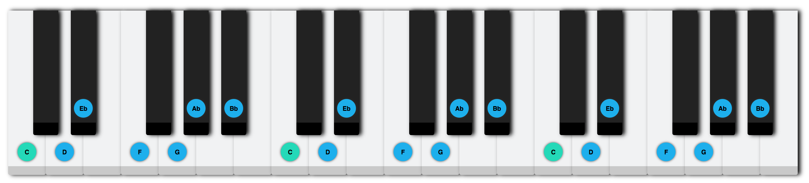
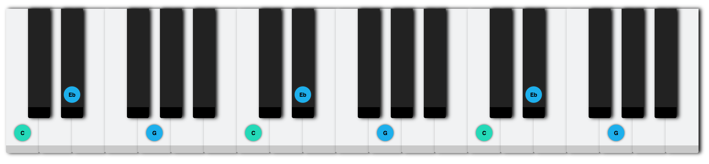
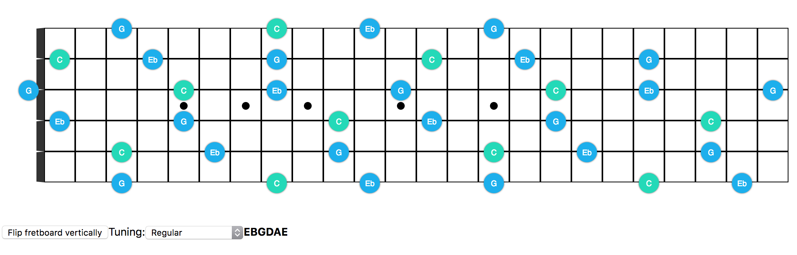
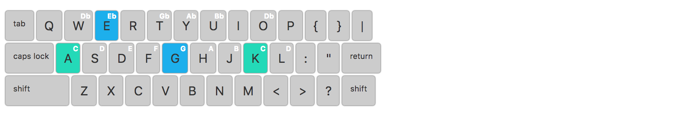

# Johann
[Generate chords & scales to practice on your guitar, piano or computer keyboard!](http://johann.scribbletune.com)

---

This is a new WIP project that is aimed at helping personal guitar, musical keyboard or computer keyboard music practice. It originates from a personal requirement for being able to put together a chart of notes to practice. This could be for a scale/mode or a chord across the instrument. Basically it helps you focus on the notes you wanna play and practice. For instance on a musical keyboard, you may want to just highlight the C Minor scale so that you can play over it. This little app will let you select the required root note and the scale to generate this:

The same can be done for a triad. You can generate a sheet with just the notes of the C Minor chord to practice it's notes across the fretboard (or in this case the musical keyboard):

The green dot is the root note and the blue dot is a note from the selected scale or chord.

The same can be done for guitars...

and computer keyboards too!

Demo: https://scribbletune.github.io/johann/#/
